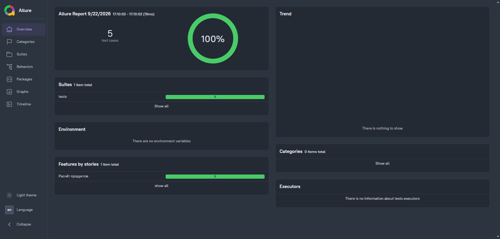
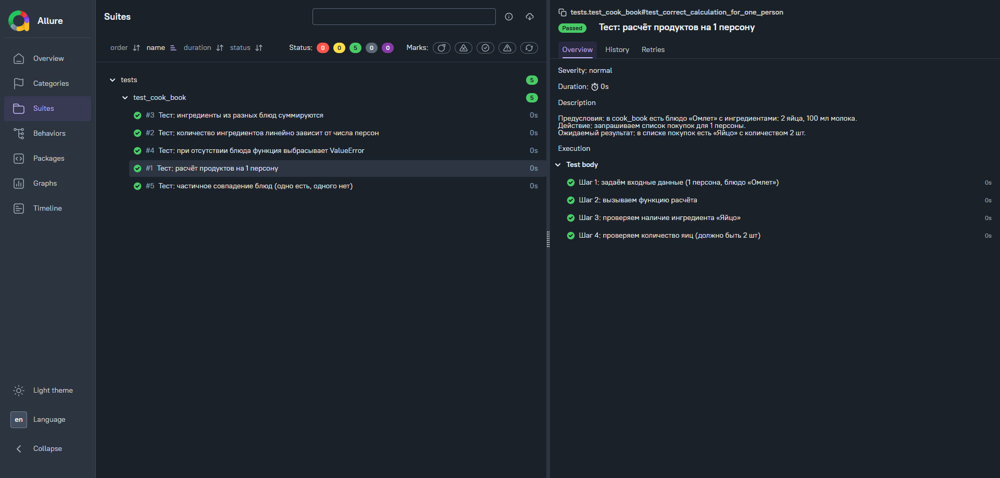
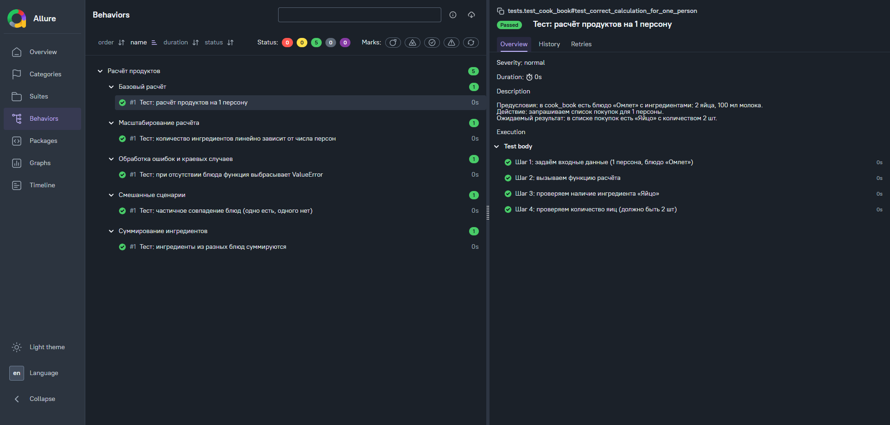

# Cook Book: расчёт списка покупок

Проект демонстрирует автоматизацию тестирования функции расчёта списка покупок. Реализовано на Python с использованием `pytest` и `allure-pytest`. Проект показывает полный QA‑цикл: от локализации дефекта до исправления теста и интеграции с CI.

## Суть задачи

Реализована функция `get_shop_list_by_dishes(dishes, person_count)`, которая:
- Возвращает словарь ингредиентов с суммарным количеством.
- Выбрасывает `ValueError`, если какое‑либо блюдо отсутствует в `cook_book`.

## QA‑цикл: как я нашла и исправила несоответствие

Автоматизировано **5 тест‑кейсов**. Один из тестов изначально падал — это позволило показать полноценный процесс ручного тестировщика в автотестах:

1. **Локализация проблемы:** тест ожидал пустой словарь при отсутствии блюда, но функция выбрасывала `ValueError`.
2. **Анализ:** несоответствие между ожиданием теста и реальным поведением кода.
3. **Решение:** тест переписан на проверку исключения через `pytest.raises(ValueError)`.
4. **Результат:** все 5 тестов проходят, отчёт Allure содержит понятные описания и шаги.

Это отражает мой опыт ручного тестирования: я не просто запускаю автотесты, а проверяю соответствие поведения системы требованиям и фиксирую это в отчётах.

## Автотесты и отчёт Allure

Тесты структурированы по аналогии с ручными тест‑кейсами:
- **Features и Stories:** группировка по функциональным областям (как в тест‑плане).
- **Descriptions:** предусловия, действие, ожидаемый результат прямо в отчёте.
- **Steps:** раскрывающиеся шаги воспроизведения (аналог шагов в баг‑репорте).

Отчёт позволяет быстро оценить покрытие и детали проверок:





> Скриншоты расположены в папке `screenshots`.

## Структура проекта

📁 my_project/
├── 📄 README.md                     # Описание проекта и скриншоты отчёта
├── 📦 requirements.txt              # Зависимости (pytest, allure-pytest)
├── 🧪 pytest.ini                    # Конфигурация pytest
├── 📝 recipe.txt                    # Примеры данных/рецептов для тестов
├── 🗂 screenshots/                  # Изображения для README
│   ├── allure_overview.png
│   ├── allure_features_stories.png
│   └── allure_test_details.png
├── 🐍 main.py                       # Реализация функции get_shop_list_by_dishes и словарь cook_book
├── 🧪 tests/
│   └── 🧪 test_cook_book.py          # Автотесты с Allure‑аннотациями
├── 🚫 .gitignore                    # Игнорирование временных файлов
└── 🏗 .github/
└── workflows/
└── python-tests.yml          # CI: автоматический запуск тестов и публикация отчёта

## Интеграция с CI (GitHub Actions)

Проект интегрирован с GitHub Actions: при каждом `push` запускаются тесты, формируется Allure‑отчёт и публикуется как артефакт. Это показывает понимание полного пайплайна: от написания тестов до их автоматического запуска и хранения отчётов.

Пример workflow: `.github/workflows/python-tests.yml`.

## Как запустить локально

1. **Установить зависимости:**
   ```bash
   pip install -r requirements.txt
   ```
2. **Запустить тесты:**
   ```bash
   pytest --alluredir=allure-results
   ```
3. **Просмотреть отчёт:**
   ```bash
   allure serve allure-results
   ```
4. **Запустить тесты и сгенерировать отчёт:**
   ```bash
   pytest --alluredir=allure-results
   ```
5. **Открыть отчёт в браузере:**
   ```bash
   allure serve allure-results
   ```
   
### Требования
- Python 3.10+
- Установленный Allure CLI (для просмотра отчётов)